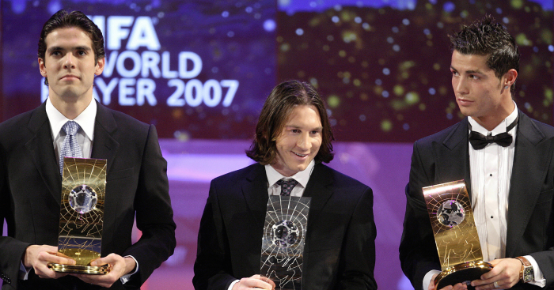
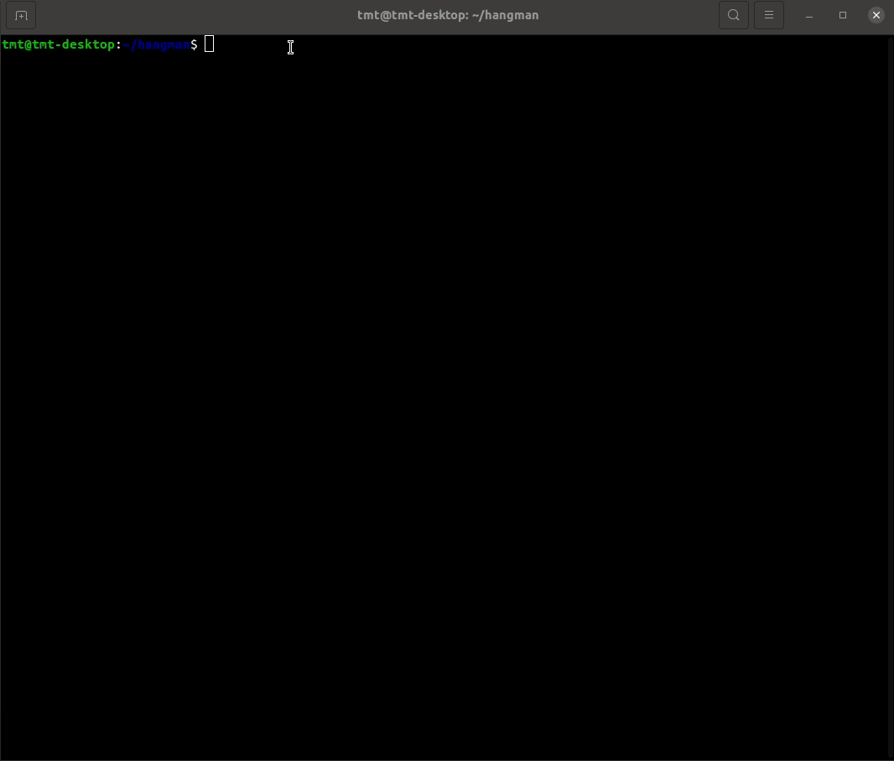

## Do you know all the FIFA Player of the Year winners?

---

---

## / Check it wit CLI hangman-like text game /

#### Dependencies
### * 

#### Run in the terminal to play:
### `ruby play.rb`

#### Type anytime to quit:
### `exit`

---

